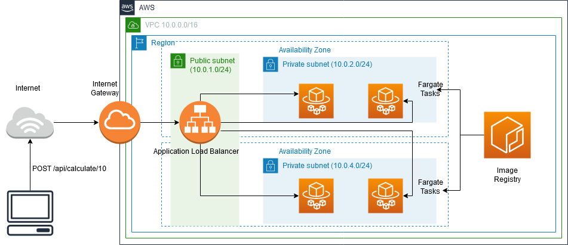

[](https://codeclimate.com/github/rgalba/fibonacci-api/maintainability)
[](https://codeclimate.com/github/rgalba/fibonacci-api/test_coverage)
[](https://travis-ci.org/rgalba/fibonacci-api)
[](https://opensource.org/licenses/Apache-2.0)

# Fibonacci API

Awesome Simple API to calculate Fibonacci series for a given number.  

## Stack

- Java 11
- Springboot 2
- Gradle 5.6
- Docker
- AWS Fargate

## Serverless deployment on AWS Fargate

  
*AWS Fargate diagram*  

---
This API can be deployed on a serverless cluster using AWS Fargate.  
Pros:
- There is no need to manage infraestructure (*serverless*). AWS ECS will create a process based on CPU and memory preferences.
- There is no need to manage a container orchestration service (*clusterless*).
- Elasticity and scalability (scale in and out) built in.
- Springboot-based development for serverless (or any container-compatible stack).
- Integration with AWS native services (IAM, Cloudwatch, security group etc) at the container level.

Cons:
- It is not possible to run `exec` direct to a container. It require other ways to debug/trace. Ex: `spring actuator API`.

## How to use 

#### Credentials

In order to use the API, follow the credentials:

> username: admin  
> password: s3cr3t  

1 - To calculate series for number 2  

```shell script
$ curl http://localhost:8080/api/calculate/2 \
  --header 'accept: application/json' \
  --header 'authorization: Basic YWRtaW46czNjcjN0'

[
	1,
	1
]
```

2 - To health check  

```shell script
$ curl --request GET \
    --url http://localhost:8080/actuator/health \
    --header 'accept: application/json' \
    --header 'authorization: Basic YWRtaW46czNjcjN0'

{
	"status": "UP"
}
```

3 - To shutdown application for HA testing purposes

```shell script
$ curl --request POST \
  --url http://localhost:8080/actuator/shutdown \
  --header 'accept: application/json' \
  --header 'authorization: Basic YWRtaW46czNjcjN0'

{
	"message": "Shutting down, bye..."
}
```

## How to debug via API

You can use the `/actuator` API to get several information about the service. Just do a GET:

```shell script
$ curl --request GET \
  --url http://localhost:8080/actuator/ \
  --header 'accept: application/json' \
  --header 'authorization: Basic YWRtaW46czNjcjN0'

{
	"_links": {
		"self": {
			"href": "http://localhost:8080/actuator",
			"templated": false
		},
		"beans": {
			"href": "http://localhost:8080/actuator/beans",
			"templated": false
		},
		"caches-cache": {
			"href": "http://localhost:8080/actuator/caches/{cache}",
			"templated": true
		},
        ...
    }
}
```

## How to build

In order to run, install gradle 5.6 and run `gradle build` on repo path.

## Useful Docker commands

```sh
docker images
docker container ls
docker logs <container_name>
docker container rm <container_name
docker image rm <image_name
```